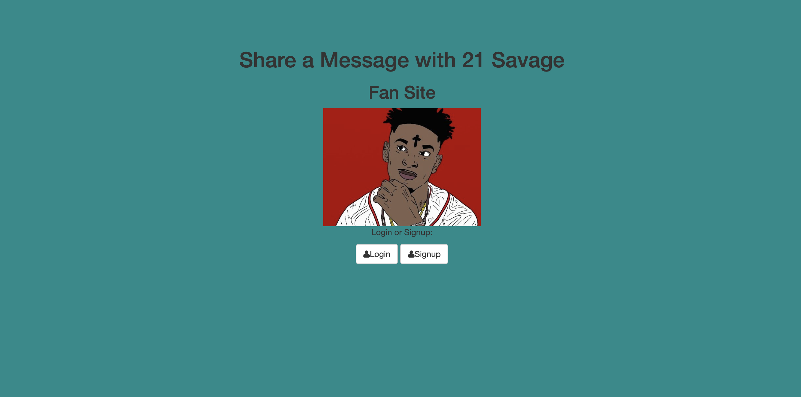
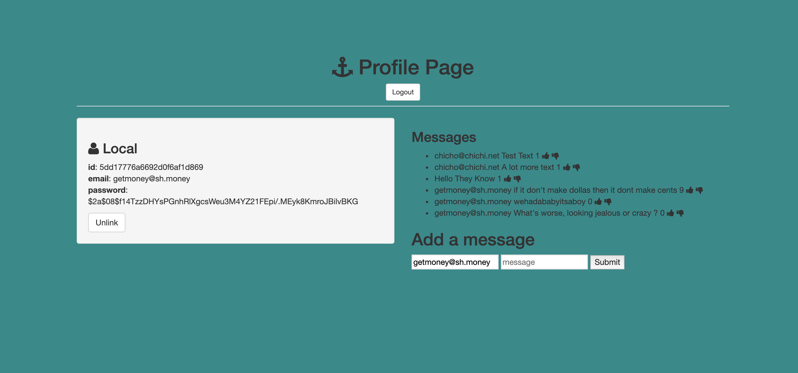

# Savage Fan Site with Login Page 

## Goal: Create a 21 Savage fan site where users can create an account, login and add messages to a fan messages board. Messages on the board can then be upvoted or down voted. 

## Installation

1. Clone repo
2. run `npm install`

## Usage

1. run `node server.js`
2. Navigate to `localhost:8080`

## Credit

Modified from Scotch.io's auth tutorial
