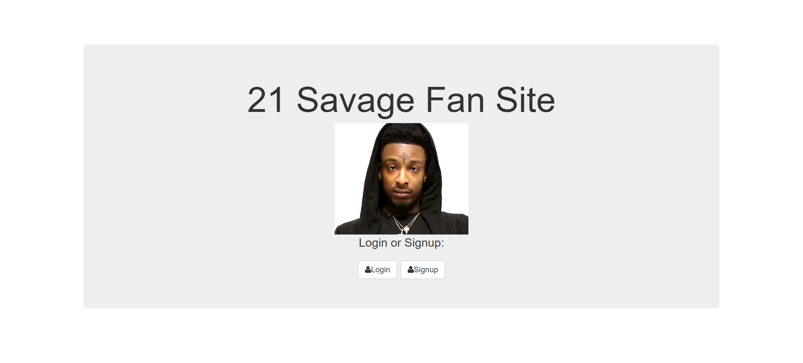
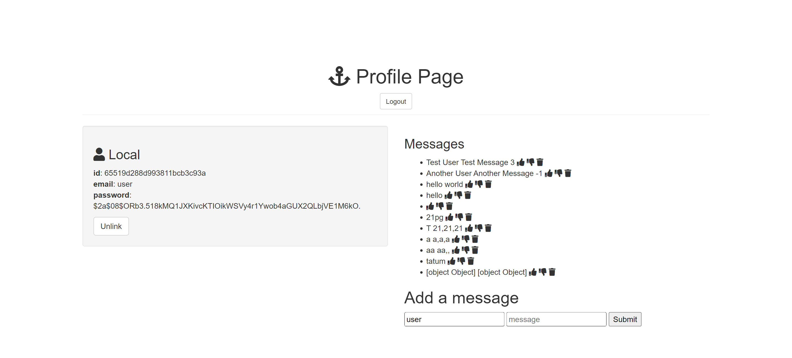

# 21 Savage Fan Site (With User Authentication) 💸🗡️💔

### Description
Welcome to the 21 Savage Fans platform, where you can sign up, log in, share your thoughts and messages about 21 Savage, and interact with other fans.

### How to Use
1. Sign up or log in.
2. Scroll down to the "Add a message" section.
3. Enter your name and message in the respective input fields.
4. Click the "Submit" button to share your message with the 21 Savage community.

### Features
- **User Authentication**: Supports local authentication.
- **Profile Page**: Users have a profile page where they can view and post messages.
- **Dynamic Messages**: View and interact with messages from other users.
- **Thumbs Up/Down**: Show your approval or disapproval for a message by clicking on the corresponding thumbs-up or thumbs-down icon.
- **Message Sorting**: Messages are sorted based on the net count of thumbs up/down in descending order. The messages with the highest count will appear first, allowing users to discover the most popular content quickly.
- **Message Deletion**: Remove messages by clicking on the trash icon.

### Tech Used
- **Node.js**: Backend JavaScript runtime.
- **Express**: Web application framework for Node.js.
- **MongoDB**: NoSQL database for storing user information and messages.
- **Passport**: Authentication middleware for Node.js.
- **EJS**: Templating engine for rendering dynamic content.
- **Bcrypt-nodejs**: Library for hashing passwords.
- **Morgan**: HTTP request logger middleware.
- **Cookie-parser**: Middleware for parsing cookies.
- **Body-parser**: Middleware for handling request data.
- **Connect-flash**: Middleware for handling flash messages.

### File Structure
- **models/user.js**: Defines the schema for the user model and methods for password hashing and validation.
- **routes.js**: Defines application routes, including user authentication, message posting, and interaction.
- **config/database.js**: Configuration file for the MongoDB connection.
- **config/passport.js**: Configuration file for Passport authentication strategies.
- **public/main.js**: Frontend JavaScript for handling message interactions.
- **views**: Contains EJS templates for different views such as login, signup, profile, and index.
- **server.js**: Main entry point for the application.

### Lessons Learned
- **Modularizing Code**: Prioritizing modularization enhances maintainability.
- **Utilizing Middleware Effectively**: Middleware (Passport, Morgan, Cookie-parser, Body-parser) plays a crucial role in authentication and request handling.
- **Integrating MongoDB**: MongoDB and Mongoose facilitate efficient NoSQL database interactions.
- **Handling Frontend Interactions**: Vanilla JavaScript effectively manages asynchronous requests for thumbs up/down and message deletion.
- **Implementing Authentication Strategies**: Passport handles local and third-party authentication seamlessly.